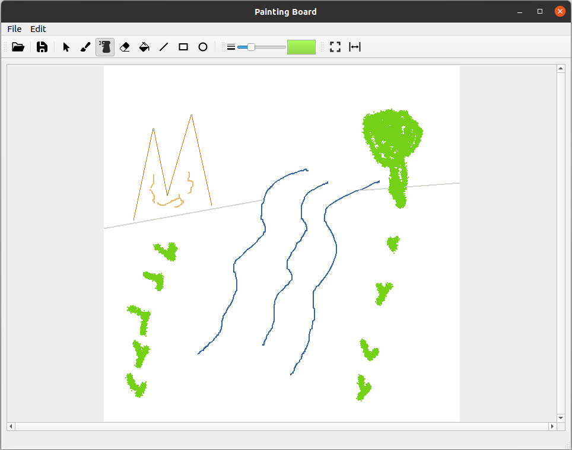

# PaintingBoard

Just a toy painting app.



## Features

- Simple painting: hand-written pen, brush, eraser; line, rectange, circle...
- Simple image manipulation: flip, blur, filter...

## Built With

- PyQt5
- opencv
- rxpy

## Usage

```bash
pip install -r requirements.txt
python run.py
```